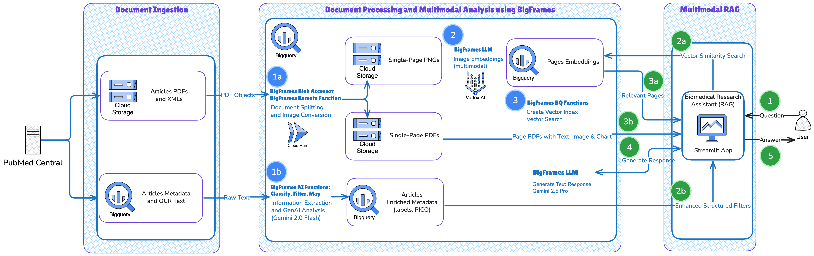
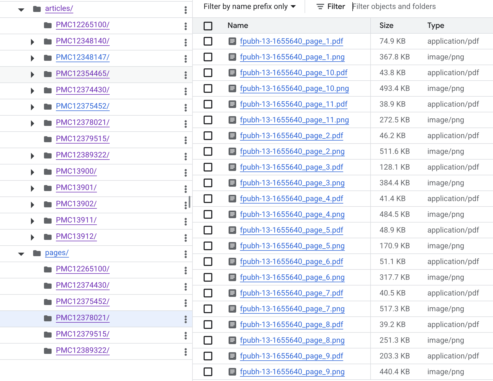

## MedQuery - A Multimodal AI Assistant for Biomedical Research

The biomedical semantic search project, centered on the "nutrition and well-being" subset of the PMC Open Access dataset, is a showcase of the power of BigQuery's generative AI and multimodal capabilities.



## Problem Statement

With over a million new articles published annually, the biomedical literature has created a deluge of information that overwhelms readers and researchers alike. Adding to this challenge is the proliferation of misinformation, which obscures scientifically-backed findings and hinders informed decision-making by elected officials and the general population. Critical data—from clinical trial results in tables to survival curves in charts—remains locked within visual formats, inaccessible to traditional keyword search and even modern text-only RAG systems. These systems rely on Optical Character Recognition (OCR), which struggles with the complex layouts of scientific papers, leading to missed information and flawed analysis. As a result, researchers and clinicians waste valuable time and risk overlooking crucial evidence, while the spread of disinformation further complicates the challenge of accessing and applying reliable knowledge.

## Impact Statement

MedQuery directly addresses this by providing a comprehensive multimodal semantic search platform for biomedical literature, by treating entire document pages as images. By processing entire document pages as images and using a scalable and cost-effective data & AI pipeline on BigQuery, the system unlocks data previously trapped in visuals, understands the conceptual intent of user queries, and make the scientific evidence readily accessible and usable by everyone. This leads to more accurate retrieval, richer context for AI-generated grounded summaries, and a significant reduction in the time researchers spend searching for information, thereby accelerating the pace of research, scientific discovery, evidence-based practice and information dissemination to the general public.

### AI Assistant (Streamlit App)

[](https://www.youtube.com/watch?v=v3UqB2KVb-M)


## Project Overview

This project serves as a comprehensive blueprint that touches on all three pillars of the [BigQuery AI Hackathon](https://www.kaggle.com/competitions/bigquery-ai-hackathon/overview/):

1.  **The Multimodal Pioneer 🖼️**: We begin by treating entire PDF pages as images, creating a structured interface over unstructured files in Cloud Storage using **Multimodal BigFrames** and **BlobAccessor** functions. This allows us to work with visual data natively within the BigQuery ecosystem.

2.  **The Semantic Detective 🕵️‍♀️**: Using BigFrames, we generate powerful vector representations of each page with a `MultimodalEmbeddingGenerator` (which leverages **`ML.GENERATE_EMBEDDING`**). To ensure high-performance retrieval, we then build a **`VECTOR_INDEX`** and use **`vector_search`** to find the most semantically and visually relevant pages for a user's query.

3.  **The AI Architect 🧠**: To enrich our dataset, we use BigFrames' built-in AI capabilities (`.ai.classify`, `.ai.map`) to automatically classify articles and extract structured metadata like PICO components—a process powered by functions like **`AI.GENERATE_TABLE`**. The final, synthesized answer is generated by passing the retrieved visual context to a **`GeminiTextGenerator`**.

### Key Files

*   **`nb_semantic_search_rag.ipynb`**: The core Jupyter notebook that implements the end-to-end data processing pipeline. It covers article PDFs ingestion, structured and unstructured data processing and enrichment, multimodal (image) embedding generation, vector indexing, and the implementation of the RAG logic using BigFrames, BigQuery AI and BigQuery Vector Search.
*   **`streamlit/app.py`**: The Streamlit application that provides the user interface for the AI assistant. It handles user queries, performs the vector search against BigQuery, and uses Gemini to generate and display the final synthesized answer.

### Rationale: The Power of Multimodal Embeddings for Biomedical Literature

The architecture of this project is grounded in recent, state-of-the-art research that has demonstrated the superiority of "visual" or "multimodal" RAG for document understanding. This approach, exemplified by solutions like **VisRAG** [1] and **ColPali** [2], moves beyond traditional text-based systems by treating document pages as images. This allows the AI to understand not just the text, but also the critical context contained in charts, tables, and layouts.

This is particularly impactful for biomedical literature, which is not just text-dense but also visually rich. Traditional search systems that rely on OCR (Optical Character Recognition) are blind to this visual information and face several limitations:

1.  **Loss of Visual Data:** A text-only approach completely misses the rich, quantitative information presented in visuals. A survival curve chart, a table of clinical trial results, or a diagram of a molecular pathway contains data that cannot be adequately represented by OCR text alone.
2.  **OCR Errors:** Biomedical papers often have complex, multi-column layouts, with small fonts in tables and figures. OCR is notoriously error-prone in these scenarios, leading to garbled text and a failure to index the most important information correctly.
3.  **Lack of Context:** The spatial relationship between text and visuals is lost. A text-based system doesn't understand that a specific caption refers to the chart directly above it, or that a table's columns and rows represent a specific relationship between data points.

This project overcomes these limitations by adopting a **multimodal embedding strategy**, inspired by the VisRAG and ColPali papers. Instead of relying on imperfect OCR, we treat each page of an article as a single image. This image is then processed by a multimodal foundation model, which generates a vector embedding that captures a holistic understanding of the page, including:

*   The **textual content**.
*   The **visual structure** (layout, tables, charts).
*   The **semantic meaning** that arises from the combination of text and visuals.

#### Key Benefits and Impact

By using multimodal embeddings, we create a search system that is far more powerful and intuitive for biomedical researchers:

*   **Improved Retrieval Accuracy:** The vector search becomes significantly more accurate. It can now match a user's query to the conceptual meaning of a chart, table, or diagram, returning more relevant pages that a text-only search would miss. A researcher can ask, "Which studies show a significant improvement in patient survival?" and the system can retrieve pages containing survival curve charts, even if the exact query text isn't present.
*   **Enhanced RAG Performance:** The benefits extend directly to the downstream Retrieval-Augmented Generation (RAG) pipeline. Because the retrieval step can pull back pages with relevant visuals, these images can be passed directly as context to a multimodal LLM like Gemini. This gives the LLM richer, more accurate information to synthesize its final answer, allowing it to cite data and trends directly from the visual evidence in the articles.
*   **Unlocking "Hidden" Data:** This approach effectively unlocks the data previously trapped in visual formats, making it fully searchable and usable by the AI.
*   **Resilience to OCR Failures:** By treating the page as an image, we bypass the most common OCR failure points. The model can interpret the content of a table or figure directly from the pixels, even if the text is too small or the layout too complex for traditional OCR.

In essence, this multimodal approach provides a richer, more accurate, and more comprehensive representation of the source material. It is the core rationale for this project's architecture, leading to a superior search and synthesis experience for researchers.

## Architecture: Biomedical RAG and Analysis Pipeline

This architecture outlines a comprehensive pipeline for ingesting, processing, analyzing, and querying biomedical articles from PubMed Central. The system leverages BigQuery and Vertex AI to create a powerful, scalable RAG (Retrieval-Augmented Generation) and data analysis platform.

**1. Data and Metadata Ingestion:**

*   **Source:** The process begins with a list of article identifiers (PMCIDs) from PubMed Central related to "human nutritional health".
*   **Articles PDF Upload:** For each PMCID, the notebook's Python code fetches the full article package (`.tar.gz`) from the NCBI public repository. It extracts the primary PDF and NXML files from the downloaded archive and uploads them to a **Cloud Storage** bucket. The Cloud Storage bucket serves as the central data lake for all unstructured data (raw and unprocesssed as we will see).
*   **Metadata Parsing and Storage:** The notebook also parses the NXML files to extract key metadata such as title, abstract, authors, and full text. This extracted metadata, along with the new Cloud Storage URIs for the corresponding PDF and NXML files, are loaded in a **BigQuery** table `articles`. This table acts as the primary manifest for all processed articles.

**2. RAG Pipeline: Document Processing and Embedding in BigQuery:**
*   **Document Splitting (Cloud Run):** To prepare for semantic search, a remote function (deployed in Cloud Run and triggered via BigQuery DataFrames) processes each article's PDF. It splits the multi-page documents into single-page PNG images and PDFs, allowing for page-level multimodal analysis of both text and visual elements. These assets are stored back into Cloud Storage. All pages metadata and corresponding Cloud Storage URIs are loaded in a **BigQuery** table `pages`.

*   **Embedding Generation (Vertex AI):** Using BigQuery DataFrames (`bigframes`), the embedding generation happs directly on the GCS objects without manual data movement or complex access control. The **Vertex AI Multimodal Embedding model** is used to create vector embeddings of each document page. This model processes the visual (PNG) content of the page to generate a rich semantic embedding. It captures charts, images, graphs and not only text.
*   **Vector Indexing (BigQuery Vector Search):** The generated embeddings are loaded into a **BigQuery** table `pages_embeddings` and indexed using **BigQuery Vector Search**. This creates a scalable and efficient index for performing similarity searches.

**3. Generative AI Analysis in BigQuery:**

*   **In-database AI with BigQuery DataFrames:** Using BigQuery DataFrames (`bigframes`), generative AI analysis is performed directly within BigQuery, avoiding data movement.
*   **Vertex AI Gemini Models:** The **Gemini API** is used to power several analysis steps on the article text and abstracts stored in BigQuery:
    *   **Classification:** Articles are automatically classified by study type (e.g., "RCT", "Observational Study") and patient population (e.g., "Pediatric", "Geriatric").
    *   **Structured Extraction:** Key information is extracted from abstracts into a structured format using the PICO (Population, Intervention, Comparison, Outcome) framework.
*   **Enriched Metadata:** The results of this AI-powered analysis are saved back into a new `article_labels` table in **BigQuery**, enriching the original metadata.

**4. Interactive Search and Q&A:**

*   **User Interface (Streamlit on Cloud Run):** A **Streamlit** application, containerized and deployed on **Cloud Run**, provides the user interface for the system.
*   **RAG Workflow:**
    1.  A user submits a natural language query (e.g., "What is the effect of vitamin D on pediatric bone density?").
    2.  The Streamlit app sends the query to the **Vertex AI Embeddings API** to generate an embedding for the user's question.
    3.  This query vector is used to perform a similarity search against the **BigQuery Vector Search** index using the `VECTOR_SEARCH` function.
    4.  The search returns the most relevant document pages (the "context").
    5.  The original query and the retrieved context are passed to the **Vertex AI Gemini API** in a final prompt.
    6.  Gemini synthesizes the information to generate a comprehensive, context-aware answer, which is displayed to the user in the Streamlit app.
*   **Enhanced Filtering with Generative AI:** The Streamlit application's search capabilities are significantly enhanced by leveraging `AI.classify` and `AI.map` within the BigQuery pipeline. This approach complements the semantic search functionality by adding a layer of structured filtering, creating a more powerful and precise research tool.
    *   **Dynamic Filter Creation:**
        *   **`AI.classify`:** This function is used to categorize articles based on their content, such as by **Study Design** ("Randomized Controlled Trial," "Observational Study") or **Medical Domain** ("Cardiology," "Oncology"). These classifications are then used to populate multi-select filters in the Streamlit app.
        *   **`AI.map`:** This function extracts specific data points from the articles, such as **Patient Population Size** or key biomarkers. This allows for the creation of more granular filters, like a slider for the number of study participants.
    *   **Impact on User Experience:**
        *   **Increased Precision:** Researchers can combine broad semantic searches with these specific filters to quickly find highly relevant articles. For example, a user could search for "the effects of statins on cholesterol" and then filter for "Randomized Controlled Trials" with a patient population greater than 1000.
        *   **Improved Efficiency:** This layered filtering approach saves researchers a significant amount of time by allowing them to rapidly narrow down the search results to the most relevant articles.
    *   **Synergy with Semantic Search:**
    Semantic search excels at understanding a user's intent and finding conceptually related articles. The structured filters, powered by the metadata generated by `AI.classify` and `AI.map`, provide an orthogonal method for refining the search results. This combination provides the best of both worlds: the flexibility of natural language search and the precision of structured filtering.

### Example 1: Multimodal Search for a Vague Query

**User Query:** "Find me articles on the long-term effects of a high-sugar diet on the gut, and specifically, how this relates to chronic inflammation, using this chart from a different study:"

*   **Attached Image:** A chart depicting a metabolic pathway or an inflammatory marker over time.

**Behind the Scenes:**
1.  The system uses a multimodal model to generate a single, dense vector embedding from both the user's text query and the provided image.[1, 2] This vector simultaneously captures the concepts of "high-sugar diet," "gut health," and the visual pattern of the chart.
2.  It performs a vector search on the indexed 60,000 articles, rapidly identifying the top 10 most semantically similar articles. This process is highly efficient because it's measuring conceptual proximity rather than individual keyword occurrences.
3.  The system retrieves the full text and associated images (e.g., charts, graphs) from the most relevant articles.
4.  It passes this retrieved content as context to a generative AI model, with a prompt to synthesize a summary.

**Resulting Output:**
"Based on a review of relevant literature, a high-sugar diet is strongly associated with changes in gut microbiota composition, often leading to a decrease in beneficial bacteria and an increase in pro-inflammatory species. This dysbiosis, or imbalance, is a key driver of intestinal permeability (leaky gut), allowing endotoxins to enter the bloodstream. This process is documented in **Article A** and **Article C**, which show that a high-sugar intake directly correlates with elevated levels of C-reactive protein (a marker for inflammation) in mouse models. A chart in **Article B** further illustrates how chronic consumption of simple sugars alters the integrity of the gut lining, leading to a sustained inflammatory response that could contribute to systemic diseases. The research indicates that dietary changes are a primary intervention for this type of inflammation, with the potential to improve both gut-specific and systemic health."

---

### Example 2: Uncovering Latent Connections with a Semantic Query

**User Query:** "I'm a public health official. Provide me with the key takeaways from the research on effective community-based interventions that have successfully improved adolescent eating habits in underserved populations."

**Behind the Scenes:**
1.  The system converts the complex, jargon-heavy query into a vector embedding. It understands that "community-based interventions" and "adolescent eating habits" are the core semantic concepts.
2.  The vector search retrieves articles that discuss public health programs, youth nutrition, and socioeconomic factors, even if they don't use the exact words from the query.
3.  The generative model then reads and synthesizes the findings from the most relevant articles.

**Resulting Output:**
"According to multiple studies, successful community-based interventions for improving adolescent nutrition typically involve a multi-pronged approach. Key findings include:

*   **School-based programs:** Programs that incorporate hands-on cooking classes and school garden initiatives, as detailed in **Article D**, have shown a measurable increase in vegetable consumption.
*   **Family-centered education:** Interventions that involve entire households, such as those described in **Article E**, are more effective at creating lasting dietary changes than those focused solely on the adolescent.
*   **Access and affordability:** A study published in **Article F** highlights the critical role of improving access to fresh, healthy foods and making them more affordable in food deserts.

The consensus is that while individual dietary advice is useful, systemic change requires a holistic approach that addresses environmental and social determinants of health."

---

### Example 3: Chart Analysis and Information Synthesis

**User Query:** "What are the most effective exercise routines for reducing biomarkers of metabolic disease, and can you show me data for both men and women?"

**Behind the Scenes:**
1.  The query's concepts, "exercise routines," "metabolic disease biomarkers," and the implicit need to see gender-specific data, are encoded into a vector.
2.  The vector search retrieves articles that contain relevant text and also point to a variety of visual data, such as bar charts, scatter plots, and tables. The system specifically prioritizes articles that include comparative data between genders.
3.  The generative model receives both the text and the visual data as context. It can then analyze the tables and charts directly.

**Resulting Output:**
"Research suggests that a combination of aerobic exercise and resistance training is highly effective for reducing key metabolic disease biomarkers, such as HbA1c and fasting glucose levels.

A chart from **Article G** shows that after 12 weeks of a combined training program, male participants saw a 15% reduction in fasting insulin, while female participants experienced a 12% reduction, underscoring the benefits for both genders. The paper also includes a detailed table breaking down the specific reductions for each biomarker.

Another study, highlighted by a graph in **Article H**, demonstrates that consistent, moderate-intensity aerobic exercise (e.g., 150 minutes per week) is independently linked to significant improvements in blood lipid profiles, with equally positive outcomes for both men and women.

The data consistently shows that a combination of exercise modalities yields the most comprehensive benefits, and the results are not significantly different across genders, although specific biomarkers may respond differently."

### The Semantic Advantage: Beyond Keyword Search

The examples above highlight a fundamental shift from traditional keyword-based search to a more intelligent, context-aware system. The key advantages of this RAG-based approach include:

*   **Conceptual Understanding:** Instead of matching exact keywords, the system understands the user's intent and the semantic meaning of the documents. This allows it to find relevant information even when the query and the document use different terminology.
*   **Multimodal Search:** The system can understand and search based on both text and images, allowing for more complex and nuanced queries that are impossible with text-only search.
*   **Information Synthesis:** The RAG pipeline doesn't just return a list of documents; it synthesizes the information from the most relevant sources into a concise, easy-to-understand answer. This saves the user the effort of manually reading and synthesizing the information themselves.
*   **Visual Data Analysis:** The system can "read" and interpret data from charts, graphs, and tables within the documents, unlocking a wealth of information that is inaccessible to traditional search engines.

#### Appendix

PMC PubMed Central Search query:

Search for "human nutritional health" leveraging the power of Medical Subject Headings (MeSH) for a more precise and impactful literature review. A core advantage of using MeSH is the ability to strategically include or exclude entire conceptual subtrees, a capability that a simple keyword search cannot replicate:

`https://pmc.ncbi.nlm.nih.gov/search/`

```
"has pdf"[filter] AND "Diet, Food, and Nutrition"[mh] AND ("Public Health"[mh] OR "Health Status"[mh] OR "Disease"[mh] OR "Exercise"[mh]) NOT "Animal Nutritional Physiological Phenomena"[mh]
```

While MeSH tags are preferred, here's an alternative keyword-only based query:

```
"has pdf"[filter] AND (nutrition[tiab] OR diet[tiab] OR food[tiab]) AND ("public health"[tiab] OR wellness[tiab] OR disease[tiab] OR exercise[tiab] )
```

## References
[1] VisRAG: Vision-based Retrieval-augmented Generation on Multi-modality Documents. https://arxiv.org/abs/2410.10594

[2] ColPali: Efficient Document Retrieval with Vision Language Models. https://arxiv.org/abs/2407.01449
